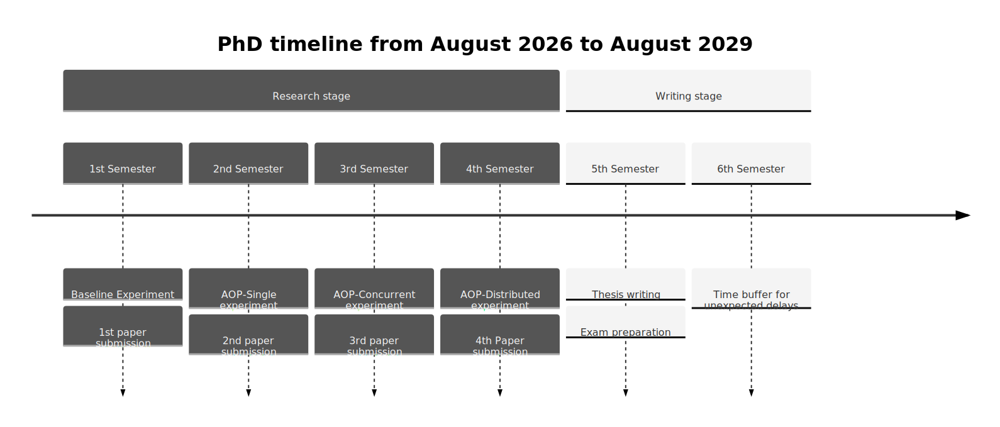

#+TITLE: Contracted Intelligence
#+BEGIN_COMMENT
All caps, bold, one line only (10-12pt).
States the subject simply — it's a label, not a description.
Avoid clever or obscure titles; clarity beats cleverness.
Example: A NEW MUSEUM OF GLASS IN NEW YORK
#+END_COMMENT
#+SUBTITLE:
#+BEGIN_COMMENT
Upper-and-lowercase, no more than two typeset lines, just under the title.
Adds dimension and flavor; piques curiosity.
Use evocative, descriptive words (soaring, critical, outmoded, new).
Does not need to be a complete sentence.
Example: A soaring statement in glass and steel to house the priceless Dale Chihouly Collection
#+END_COMMENT
#+AUTHOR: Alejandro García F.
#+DATE: <2026-04-02 jue>
#+EMAIL: agarciafdz@gmail.com
#+BIBLIOGRAPHY: references.bib
#+OPTIONS: toc:nil num:2
#+OPTIONS: html-postamble:nil
#+cite_export: csl ./acm-sig-proceedings.csl
#+HTML_HEAD: <link rel="stylesheet" href="https://cdnjs.cloudflare.com/ajax/libs/tufte-css/1.8.0/tufte.min.css" type="text/css" />
#+HTML_HEAD: <link rel="stylesheet" href="ox-tufte.css" type="text/css" />

   #+BEGIN_QUOTE
   All of this AI speed is the opposite of what is needed, \\
   Bring me 10x quality or get the f... out. \\
   --- [[https://www.threads.com/@zate75/post/DVYrkisCRVk?xmt=AQF0BzrjNUNwFTINOrvzrAB6JVLl7PZ3A0RDEwH_J69I7Q][zate75]]
   #+END_QUOTE

* Target: To get LLMs to produce reliable software.
#+BEGIN_COMMENT
Always begins with "To ...".
One central objective only — where you want to end up.
Align with the reader's wants and needs so they take ownership of the goal.
Example: To build a glass structure in midtown Manhattan to showcase the finest American glass artists.
#+END_COMMENT

* Secondary Targets :ignore:
#+BEGIN_COMMENT
Bullet list of additional goals, each beginning with "To ...".
No more than five or six items.
Each must be a logical extension of the main target — nothing narrow or off-topic.
Keep them short and snappy; stop before the list feels gratuitous.
#+END_COMMENT

- To apply Eiffel's Design by Contract as an interface for LLMs so that they generate trustworthy code.
- To compare LLMs-guided-by-contracts vs LLMs-guided-by-tests to discover which approach produces more reliable software.
- To measure time, money and defects of both approaches
- To program a valuable software product (application or library) to demonstrate he usefulness of the approach.

* Rationale :ignore:
#+BEGIN_COMMENT
Two or three paragraphs (~150 words total). Your argument and pitch.
Three internal sections (not literal headings — just organizing logic):
#+END_COMMENT

*** Setting the Stage :ignore:
#+BEGIN_COMMENT
A few sentences that:
- Capture the reader's interest.
- Establish who you are and what you know.
- Summarize the background that prompted this proposal.
Use a positive tone. Explain why the target matters.
Include any relevant timing issues, deadlines, or time-sensitive events here.
#+END_COMMENT

LLMs are capable of producing a lot of code, but those programs are not reliable.

As summarized by this headline:

   #+BEGIN_QUOTE
   [[https://www.cnbc.com/2026/03/10/amazon-plans-deep-dive-internal-meeting-address-ai-related-outages.html][Amazon called an emergency meeting]] after outages caused by AI-assisted code changes.
   The fix: put senior engineers back in the loop
   -- [[https://x.com/ThisWeeknAI/status/2031759301283316127][This week in AI News]]
   #+END_QUOTE

*** Compelling Points :ignore:
#+BEGIN_COMMENT
Build toward the climax with irrefutable, timely facts from your research.
Support the claim that target and secondary targets are achievable.
No need for emotional language — let the facts carry the weight.
Build to a prose crescendo.
#+END_COMMENT

For the past 50 years we have known that formal methods enable reliable software development, but they remain unpopular in industry due to project execution methods, certification concerns, and the *high cost associated with formal methods* [cite:@davis2013study].

The high cost of applying formal methods has made them obvious candidates to try to automate with Generative AI.
As shown by the work of [cite:@beg2025leveragingllmsformalsoftware] and [cite:@specgen]
However to the best of our knowledge there has not been work on using Design By Contract  and LLMs.

And there are two industry implementations of Design by Contract Eiffel's and ADA with SPARK.
Of those two implementations we decided to use Eiffel because of its Simplified Concurrent Object Oriented Programming (SCOOP).
Since SCOOP will help with the concurrency and distributed experiments.

*** The Pitch :ignore:
#+BEGIN_COMMENT
State clearly what your proposal will do if approved.
Explain why and how the benefits will be realized.
This should feel like a logical conclusion, not a hard sell.
#+END_COMMENT

So, given that LLMs make developing code cheaper and Formal Methods make developing software higher quality.

On this project we will try to use formal methods, in its Design by Contract incarnation, to guide LLMs creating software.
To get: "10x quality software, not just 10x lines of code"

* Methodology
#+BEGIN_COMMENT
During the project [description of research activity] to [state what will the activity achieve].
[Repeat this structure for each key methodology element that is employed to reach the objectives.]
#+END_COMMENT

During the project we will have two groups: Generate by Unit Tests (GenByTests) and Generate by Contracts (GenByContracts)
To compare code generated by LLMs with the current state of the practice (following unit tests) vs our proposal (generated by contracts).

** Experiment protocol

Each experiment runs the following procedure:

*** Specification phase (human-authored):
- GenByContracts :: A human writes a complete DbC specification for the target
  library: preconditions, post-conditions, class invariants, and frame
  rules.  No implementation is written.
- GenByTests :: A human writes a test suite for the same target library,
  split into a /training set/ (given to the LLM) and a /verification set/
  (held out for evaluation).  No implementation is written.

*** Generation phase (LLM-authored)
- GenByContracts :: An LLM receives the DbC specification and generates a complete Eiffel implementation.
- GenByTests :: An LLM receives the training-set tests and generates a  complete Eiffel implementation.

*** Evaluation phase
Both implementations are evaluated on the same axes:
- Cost :: API expense to produce a compiling,
  contract-passing (GenByContracts) or training-set-passing (GenByTests)
   implementation.
- Time :: Time required to produce a compiling implementation on each group.
- Quality :: performance on the held-out verification set, which
   neither group has seen during generation.

This design ensures the verification set is an unbiased judge: it tests
behavioral correctness that was never explicitly provided to either LLM.

** Experiments Iterations
For our experiments we will develop an implementation of Weiher's [cite:@weiher2020tyranny] Architecture Oriented Programming (AOP) library in Eiffel.

In 4 iterations each iteration with a bigger level of complexity.

The four experiments are:

- Baseline :: Implement (with GenByContracts and GenByTests) known data-structures  with known contracts. Like stack, queue or hash-map.
- AOP - Single :: In a single threaded environment, implement Weiher's six patterns
- AOP - Concurrent :: Implement the same patterns now in a multi-threaded processor. For this we will take advantage of Eiffel SCOOP (Simplified Concurrent Object Oriented Programming) [cite:@morandi2008scoop]
- AOP - Distributed :: Implement the same patterns now in a distributed system. For this we will build on the thesis [cite:@concurrency_scoop]

** What is AOP? and Why will it be our library example case?

AOP has a simple but powerful idea:

#+BEGIN_CENTER
What would happen if we took the architecture of large software systems,
(like HTTP and the web) and shrunk it to the level of a single program?
#+END_CENTER

With this principle Weiher developed the [[http://objective.st][Objective-Smalltalk]] programming language, but it remains the only implementation and AOP is only documented on his corpus of work.
Not specified in an executable format.

The six AOP patterns that Weiher documents are:

#+CAPTION: Six patterns of AOP
| Architectural Inspiration    | AOP Pattern                                                         |
|------------------------------+---------------------------------------------------------------------|
| Internet URIs                | Polymorphic Identifiers [cite:@weiher2013polymorphic]               |
| Internet Protocols           | Schemes [cite:@weiher2013polymorphic]                               |
| Spreadsheet cell references  | References [cite:@weiher2013polymorphic]                            |
| Unix pipes and filters       | Polymorphic Write Streams [cite:@weiher2019streaming]               |
| REST / stackable file-systems | Storage Combinators [cite:@weiher2019storage]                       |
| Constraint programming       | Constraints as Polymorphic Connectors [cite:@weiher2016constraints] |

We selected this application because:

+ It is complex enough, it is not a trivial case.
+ It is documented in the academic literature, but there is only one implementation so we can assume LLMs haven't been trained on how to develop it.
+ It is an ideal candidate to be specified with Design by Contract by virtue of being inspired by HTTP Protocol that was inspired by DbC.
+ The resulting library would be valuable on its own.

* Budget
#+BEGIN_COMMENT
Every proposal involves spending, saving, or making money; address whichever apply.
Use big-picture numbers only; this is not an annual report.
Paragraph or itemized list both work.
Demonstrate you have anticipated pitfalls (cost overruns, financing risks, etc.).
If there is no financial component, explain why there are no costs.
Do NOT sweeten the numbers — be honest, competent, and confident.
#+END_COMMENT

#+CAPTION: Indicative Budget
| Item                     | Description                                                                                         |         Count |            Unit Cost |          Subtotal |
|--------------------------+-----------------------------------------------------------------------------------------------------+---------------+----------------------+-------------------|
| <l24>                    | <l>                                                                                                 |         <r12> |                <r16> |             <r16> |
| PhD stipend              | Researcher salary                                                                                   |     36 months |      mxn [[https://www.secihti.mx/wp-content/uploads/2026/02/TABBN-26-20260223T163125.pdf][$ 21,397.32]] | mxn $  770,303.52 |
| LLM API access           | 4 experiments × Groups GenByContracts + GenByTests                                                  |      9 months |    USD $ 200 / month | mxn $   64,297.08 |
| Eiffel Studio            | Academic license                                                                                    |             0 |                      | mxn $           0 |
| Conference travel        | 4 presentations (ICSE / FM / VerifyAI)                                                              | 4 conferences | [[https://web.archive.org/web/20251212191121/https://www.laser-foundation.org/verifai-26/][EUR $690]] + USD $1884 | mxn $  191,462.18 |
| Article Processing Fees  | Will publish in Diamond Open Access journals (https://programming-journal.org , https://www.jot.fm) |             4 |                      | mxn $           0 |
| Computing infrastructure | CIMAT provision                                                                                     |               |                      | mxn $           0 |
|                          |                                                                                                     |               |              *TOTAL* | mxn $1,026,052.56 |

* Status
#+BEGIN_COMMENT
Tell the reader what is already in place and what is still pending:
- Existing money commitments (amounts, conditions)
- Non-financial support (from whom)
- Roadblocks (people, companies, agencies)
- Signed contracts or pledged agreements
- Items held up by red tape or legal review

Be frank. Disclose the negative. If the proposal has been rejected before, say so.
Show momentum and enthusiasm. This section sets up the Action ask.
#+END_COMMENT

I have been working on an [[https://github.com/elviejo79/RESTLY][Eiffel AOP implementation since May 2025]].
During that time I became convinced that AOP is good paradigm to copy in other patterns.
But that I would need to speed up my productivity if I ever wanted to finish it.
That is why now I will focus on getting Generative AI to produce a correct implementation of AOP guided by contracts.
So I have already the human generated contracts that will become the basis for the second experiment /AOP - Single/.

* Participants

- PhD Candidate :: Alejandro García F., Msc. in Software Engineering from CIMAT Zacatecas
  Software engineer with over 30 years of experience.
  And the originator of the Contracted Intelligence approach,
  has prior published work on Software Engineering,
  and brings experience in formal methods,
  literate programming,
  and technical writing to the project.

- Research Supervisor :: Dr. Carlos Lara-Alvarez, Director of CIMAT Zacatecas,
  holds SNI Level I and has 537 academic citations with industry collaborations at Intel and commercial software firms on safety-critical systems.
His expertise in probabilistic models, software testing,
and human-machine systems directly covers the experimental design and evaluation methodology of this project.

* Results and Impact

The project will produce empirical evidence comparing contract-guided vs test-guided LLM code generation, including:

- A validated methodology for using DbC to guide LLMs in generating reliable software
- Quantitative measurements (cost, time, defect rates) comparing both approaches across four complexity levels
- A complete, working implementation of Weiher's AOP library in Eiffel (valuable independently)
- Four peer-reviewed publications documenting findings at each experiment iteration

Delivering these results will enable software engineering teams to adopt contract-guided AI coding practices with evidence-based confidence, and provide AI tool developers with design principles for integrating formal specifications into code generation workflows.

* Timeline

#+BEGIN_SRC mermaid :file ./images/timeline.svg
---
config:
  theme: 'base'
  timeline:
    disableMulticolor: true
---
    timeline
        title PhD timeline from August 2026 to August 2029
          section Research stage
            1st Semester : Baseline Experiment
                         : 1st paper submission
            2nd Semester : AOP-Single experiment
                         : 2nd paper submission
            3rd Semester : AOP-Concurrent experiment
                         : 3rd paper submission
            4th Semester : AOP-Distributed experiment
                         : 4th Paper submission
          section Writing stage
            5th Semester : Thesis writing
                         : Exam preparation
            6th Semester  : Time buffer for unexpected delays
#+END_SRC

#+CAPTION: The project will last for 36 months
#+RESULTS:

* What I am looking for
#+BEGIN_COMMENT
The explicit ask — if you don't ask for something, it's not a proposal.
Be unambiguous: do you want money, a committee seat, an endorsement?
State exactly what you need and make sure it is within the reader's capability.
One clear sentence is enough.
#+END_COMMENT

To be accepted in the DOCTORADO EN CIENCIAS FÍSICO MATEMÁTICAS
CON ORIENTACIÓN EN PROCESAMIENTO DIGITAL DE SEÑALES
INTELIGENCIA ARTIFICIAL

* Signature and Date :ignore:
#+BEGIN_COMMENT
Date signals the information is current.
Signature signals personal commitment and accountability.
Optional: add a copyright mark if content is sensitive or confidential.
Optional: add "Confidential" at top or bottom for sensitive material.
#+END_COMMENT

-------------
 {{{author}}}
 {{{email}}}
 {{{date}}}

* References

#+print_bibliography:
